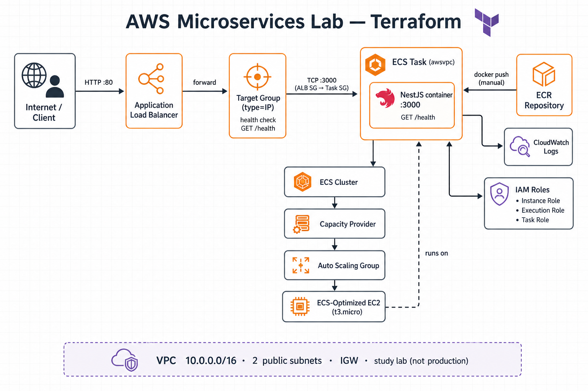

# Microservices Lab — Terraform

[](https://aws.amazon.com/)
[](https://www.terraform.io/)
[](https://aws.amazon.com/ecs/)
[](#)

Lab de estudos que provisiona na AWS um serviço NestJS (`/health`) com **ECS on EC2**, **ALB** e **ECR**, reproduzindo em Terraform a arquitetura do lab manual.

> **Não é produção.** Rede só pública, HTTP na porta 80, state local. Ideal para aprender Terraform + ECS.

## Stack

| Camada | Serviço |
|--------|---------|
| Rede | VPC, 2 subnets públicas, IGW |
| Compute | ECS (EC2 + Capacity Provider + ASG `t3.micro`) |
| Entrada | Application Load Balancer → Target Group (IP) |
| Imagem | ECR (`scan_on_push`) |
| Observabilidade | CloudWatch Logs + Container Insights |
| Acesso | ECS Exec (SSM) |

## Architecture



**Como ler o diagrama**

| Anotação | Significado |
|----------|-------------|
| `HTTP :80` | Cliente fala com o ALB na internet |
| `TCP :3000 (ALB SG → Task SG)` | Só o ALB pode chegar na app; porta 3000 não é pública |
| `target type = IP` + `awsvpc` | ALB envia tráfego ao IP da ENI da task |
| `health check GET /health` | ALB só encaminha para tasks saudáveis |
| `docker push (manual)` | Terraform cria o ECR; a imagem você sobe |
| Instance / Execution / Task | Três IAM roles com papéis diferentes |
| Capacity Provider → ASG → EC2 | De onde o cluster tira CPU/memória |

Fluxo resumido:

```text
Internet → ALB :80 → Target Group (IP) → Task awsvpc :3000 → NestJS /health
```

## Project layout

Comece por `main.tf` (composição). O “glue” fica na raiz; o peso fica nos modules.

| Path | Responsabilidade |
|------|------------------|
| `main.tf` | Chama `module.network` e `module.ecs` |
| `modules/network/` | VPC, subnets, IGW, route table |
| `modules/ecs/` | Cluster, ASG, task definition, service |
| `security_groups.tf` | ALB / EC2 / Task |
| `iam.tf` | Instance, execution e task roles |
| `ecr.tf` / `alb.tf` | Registry e load balancer |
| `moved.tf` | Migração de addresses no state |

## Prerequisites

- [Terraform](https://developer.hashicorp.com/terraform/install) `>= 1.6`
- AWS CLI configurada (credenciais com permissão para criar VPC, ECS, IAM, ALB, ECR)
- Docker (para build/push da imagem da app)

## Quick start

### 1. Variáveis

```bash
cp terraform.tfvars.example terraform.tfvars
```

Ajuste `ssh_cidr` para o seu IP público (`x.x.x.x/32`). Evite `0.0.0.0/0` fora de lab temporário.

### 2. Infra

```bash
terraform init
terraform plan
terraform apply
```

### 3. Imagem no ECR

O Terraform cria o repositório; **você** faz o build e o push.

```bash
docker build -t microservice-health .

ECR_REPO=$(terraform output -raw ecr_repository_url)

aws ecr get-login-password --region us-east-1 \
  | docker login --username AWS --password-stdin "$(echo "$ECR_REPO" | cut -d/ -f1)"

docker tag microservice-health:latest "$ECR_REPO:latest"
docker push "$ECR_REPO:latest"
```

Se o service já existia sem imagem:

```bash
aws ecs update-service \
  --cluster "$(terraform output -raw ecs_cluster_name)" \
  --service "$(terraform output -raw ecs_service_name)" \
  --force-new-deployment
```

### 4. Teste

```bash
curl "$(terraform output -raw health_url)"
# {"status":"ok"}
```

## Security groups

```text
Internet --TCP 80--> ALB SG --TCP 3000--> Task SG --> NestJS
```

A porta **3000 não fica aberta na internet** — só o ALB fala com as tasks.

## ECS Exec

```bash
aws ecs list-tasks \
  --cluster "$(terraform output -raw ecs_cluster_name)" \
  --service-name "$(terraform output -raw ecs_service_name)"

aws ecs execute-command \
  --cluster "$(terraform output -raw ecs_cluster_name)" \
  --task TASK_ID \
  --container health \
  --interactive \
  --command "/bin/sh"
```

A task precisa de conectividade de rede até os endpoints do Systems Manager.

## Destroy

```bash
terraform destroy
```

O ECR usa `force_delete = true`, então as imagens do lab saem junto com o stack.

## Study path

Ordem sugerida de leitura:

1. `modules/network`
2. `security_groups.tf`
3. `iam.tf` → `ecr.tf` → `alb.tf`
4. `modules/ecs`
5. `main.tf` (como tudo se conecta)

Terraform monta o grafo de dependências pelas referências entre resources — você não precisa criar nada na Console.
